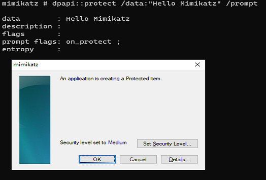

# protect

`dpapi::protect` protects data via a DPAPI call. It has the following command line arguments:

* `/c`: displays the output as a C programming language char array
* `/out`: save the results to a file
* `/data`: the data to encrypt
* `/system`: the data are encrypted under the system account context. It will be visible in the `flags : system`
* `/prompt`: the Mimikatz's additional DPAPI prompt GUI
* `/entropy`: the entropy for the encryption
* `/machine`: The data are encrypted under the machine account context. It will be visible in the `flags : local_machine`
* `/description`: provide a description for the blob data


It must be noted that during our tests when using the `/system` parameter, even running Mimikatz with `token::elevate`, the following error was raised

```
mimikatz # dpapi::protect /data:"Hello Mimikatz" /system
data : Hello Mimikatz description : flags : system ; prompt flags: entropy :
ERROR kuhl_m_dpapi_protect ; CryptProtectData (0x00000057)
```

Searching on Google the error code displayed this [link](https://social.msdn.microsoft.com/Forums/windows/en-US/bcceaafd-eac2-4133-b291-16daeea1eda0/problem-with-cryptunprotectdata-using-64-bit-win-7?forum=windowssecurity)


```
mimikatz # dpapi::protect /data:"Hello Mimikatz"

data        : Hello Mimikatz
description :
flags       :
prompt flags:
entropy     :

**BLOB**
  dwVersion          : 00000001 - 1
  guidProvider       : {df9d8cd0-1501-11d1-8c7a-00c04fc297eb}
  dwMasterKeyVersion : 00000001 - 1
  guidMasterKey      : {5c22983f-77ee-41e4-9086-8073d664e417}
  dwFlags            : 00000000 - 0 ()
  dwDescriptionLen   : 00000002 - 2
  szDescription      :
  algCrypt           : 00006603 - 26115 (CALG_3DES)
  dwAlgCryptLen      : 000000c0 - 192
  dwSaltLen          : 00000010 - 16
  pbSalt             : a912cfd0a5981bd1176cfa3a46f613e9
  dwHmacKeyLen       : 00000000 - 0
  pbHmackKey         :
  algHash            : 00008004 - 32772 (CALG_SHA1)
  dwAlgHashLen       : 000000a0 - 160
  dwHmac2KeyLen      : 00000010 - 16
  pbHmack2Key        : 8966a81153fbeecaa0f27257870c4d64
  dwDataLen          : 00000020 - 32
  pbData             : a61e42e1f1e13c06e9f45f1f813ecb8f91967195018745caf774f910e9bdf2cb
  dwSignLen          : 00000014 - 20
  pbSign             : 585b4a5b91aab83f82438508a082258af88296bb


Blob:
01 00 00 00 d0 8c 9d df 01 15 d1 11 8c 7a 00 c0
4f c2 97 eb 01 00 00 00 3f 98 22 5c ee 77 e4 41
90 86 80 73 d6 64 e4 17 00 00 00 00 02 00 00 00
00 00 03 66 00 00 c0 00 00 00 10 00 00 00 a9 12
cf d0 a5 98 1b d1 17 6c fa 3a 46 f6 13 e9 00 00
00 00 04 80 00 00 a0 00 00 00 10 00 00 00 89 66
a8 11 53 fb ee ca a0 f2 72 57 87 0c 4d 64 20 00
00 00 a6 1e 42 e1 f1 e1 3c 06 e9 f4 5f 1f 81 3e
cb 8f 91 96 71 95 01 87 45 ca f7 74 f9 10 e9 bd
f2 cb 14 00 00 00 58 5b 4a 5b 91 aa b8 3f 82 43
85 08 a0 82 25 8a f8 82 96 bb
```

Example output with the `/c` parameter:

```
mimikatz # dpapi::protect /data:"Hello Mimikatz" /c

data        : Hello Mimikatz
description :
flags       :
prompt flags:
entropy     :

**BLOB**
  dwVersion          : 00000001 - 1
  guidProvider       : {df9d8cd0-1501-11d1-8c7a-00c04fc297eb}
  dwMasterKeyVersion : 00000001 - 1
  guidMasterKey      : {5c22983f-77ee-41e4-9086-8073d664e417}
  dwFlags            : 00000000 - 0 ()
  dwDescriptionLen   : 00000002 - 2
  szDescription      :
  algCrypt           : 00006603 - 26115 (CALG_3DES)
  dwAlgCryptLen      : 000000c0 - 192
  dwSaltLen          : 00000010 - 16
  pbSalt             : a58805a047af3d5c5c728e0cd99ea2e6
  dwHmacKeyLen       : 00000000 - 0
  pbHmackKey         :
  algHash            : 00008004 - 32772 (CALG_SHA1)
  dwAlgHashLen       : 000000a0 - 160
  dwHmac2KeyLen      : 00000010 - 16
  pbHmack2Key        : 974bf2f32c5558d572b55c4342fb7d0b
  dwDataLen          : 00000020 - 32
  pbData             : 518d8d9f26507a869139c7a40f20c5cac4e90664e51961ff11df0cf5ccab0b67
  dwSignLen          : 00000014 - 20
  pbSign             : 5fd6a45422ed0bc317f71dc627bdb49fabe0f911


Blob:

BYTE data[] = {
        0x01, 0x00, 0x00, 0x00, 0xd0, 0x8c, 0x9d, 0xdf, 0x01, 0x15, 0xd1, 0x11, 0x8c, 0x7a, 0x00, 0xc0,
        0x4f, 0xc2, 0x97, 0xeb, 0x01, 0x00, 0x00, 0x00, 0x3f, 0x98, 0x22, 0x5c, 0xee, 0x77, 0xe4, 0x41,
        0x90, 0x86, 0x80, 0x73, 0xd6, 0x64, 0xe4, 0x17, 0x00, 0x00, 0x00, 0x00, 0x02, 0x00, 0x00, 0x00,
        0x00, 0x00, 0x03, 0x66, 0x00, 0x00, 0xc0, 0x00, 0x00, 0x00, 0x10, 0x00, 0x00, 0x00, 0xa5, 0x88,
        0x05, 0xa0, 0x47, 0xaf, 0x3d, 0x5c, 0x5c, 0x72, 0x8e, 0x0c, 0xd9, 0x9e, 0xa2, 0xe6, 0x00, 0x00,
        0x00, 0x00, 0x04, 0x80, 0x00, 0x00, 0xa0, 0x00, 0x00, 0x00, 0x10, 0x00, 0x00, 0x00, 0x97, 0x4b,
        0xf2, 0xf3, 0x2c, 0x55, 0x58, 0xd5, 0x72, 0xb5, 0x5c, 0x43, 0x42, 0xfb, 0x7d, 0x0b, 0x20, 0x00,
        0x00, 0x00, 0x51, 0x8d, 0x8d, 0x9f, 0x26, 0x50, 0x7a, 0x86, 0x91, 0x39, 0xc7, 0xa4, 0x0f, 0x20,
        0xc5, 0xca, 0xc4, 0xe9, 0x06, 0x64, 0xe5, 0x19, 0x61, 0xff, 0x11, 0xdf, 0x0c, 0xf5, 0xcc, 0xab,
        0x0b, 0x67, 0x14, 0x00, 0x00, 0x00, 0x5f, 0xd6, 0xa4, 0x54, 0x22, 0xed, 0x0b, 0xc3, 0x17, 0xf7,
        0x1d, 0xc6, 0x27, 0xbd, 0xb4, 0x9f, 0xab, 0xe0, 0xf9, 0x11,
};
```

Save the blob results to a file:

```
mimikatz # dpapi::protect /data:"Hello Mimikatz" /out:dpapi_blob.txt

data        : Hello Mimikatz
description :
flags       :
prompt flags:
entropy     :

**BLOB**
  dwVersion          : 00000001 - 1
  guidProvider       : {df9d8cd0-1501-11d1-8c7a-00c04fc297eb}
  dwMasterKeyVersion : 00000001 - 1
  guidMasterKey      : {5c22983f-77ee-41e4-9086-8073d664e417}
  dwFlags            : 00000000 - 0 ()
  dwDescriptionLen   : 00000002 - 2
  szDescription      :
  algCrypt           : 00006603 - 26115 (CALG_3DES)
  dwAlgCryptLen      : 000000c0 - 192
  dwSaltLen          : 00000010 - 16
  pbSalt             : 091527cbb82555872260774bd8d3ff28
  dwHmacKeyLen       : 00000000 - 0
  pbHmackKey         :
  algHash            : 00008004 - 32772 (CALG_SHA1)
  dwAlgHashLen       : 000000a0 - 160
  dwHmac2KeyLen      : 00000010 - 16
  pbHmack2Key        : ab94cd34e247f59647a4872f0ab8e647
  dwDataLen          : 00000020 - 32
  pbData             : a5e9d57d114c39374caec5983d2aa80c942d77c080f4ec7569cfb58a00357e2e
  dwSignLen          : 00000014 - 20
  pbSign             : 05ba3324d8ef8b44ef474f6ad1cf73ba1b08e58e


Write to file 'dpapi_blob.txt' is OK
```

The following picture demonstrates an example when the `/prompt` argument is used:


