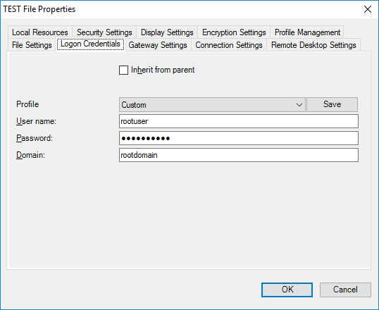
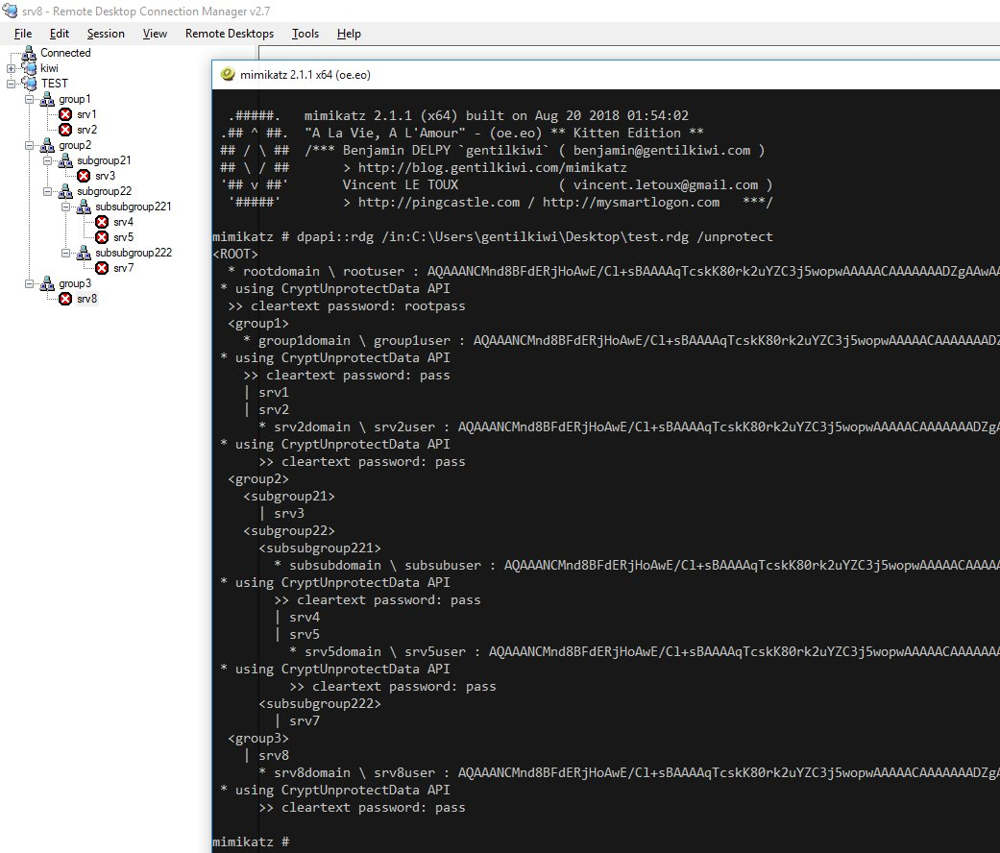

# rdg

`dpapi::rdg` decrypts Remote Desktop Gateway saved passwords. It has the following command line argument:

* `/rdg`: the `.rdg` file
* `/password`: the password to use to decrypt the rdg file
* `/masterkey`: the masterkey to use for decryption. It can be obtained through [`sekurlsa::dpapi`](https://tools.thehacker.recipes/mimikatz/modules/sekurlsa/dpapi).
* `/unprotect`: display the decryption results on screen

