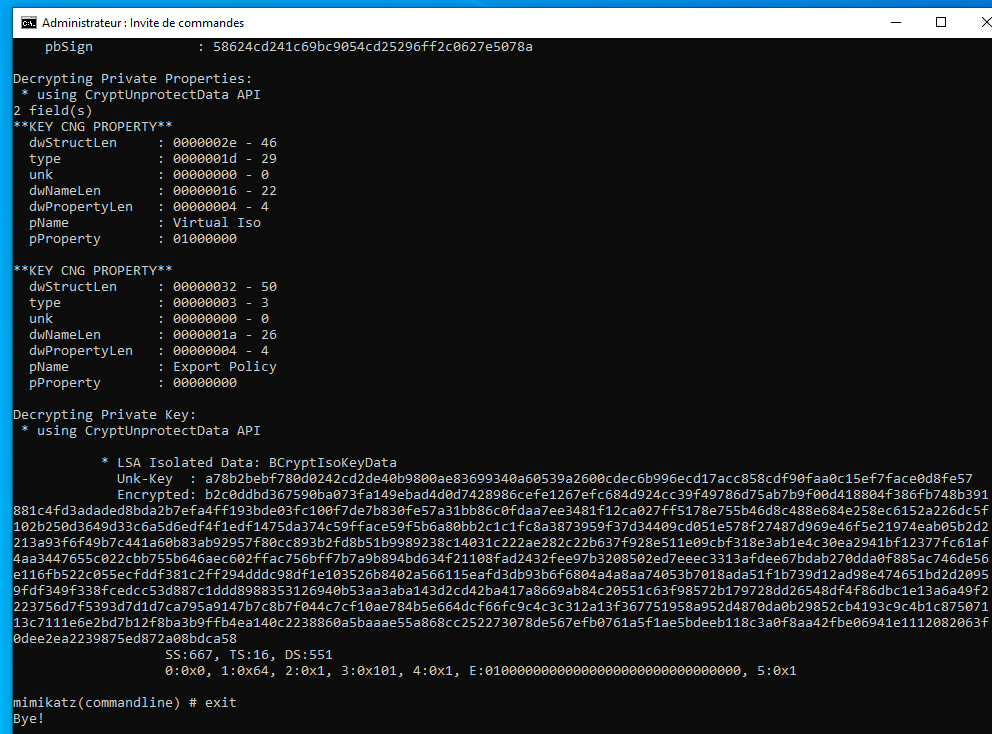

# mbc

It dumps the Machine Bound Certificate. Devices on which Credential Guard is enabled are using Machine Bound Certificates.

The following images were borrowed from [this](https://twitter.com/gentilkiwi/status/1194429033750171650) tweet:

.png>)

.png>)

