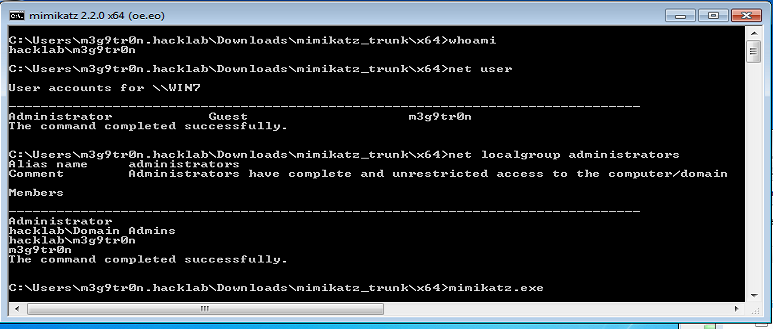
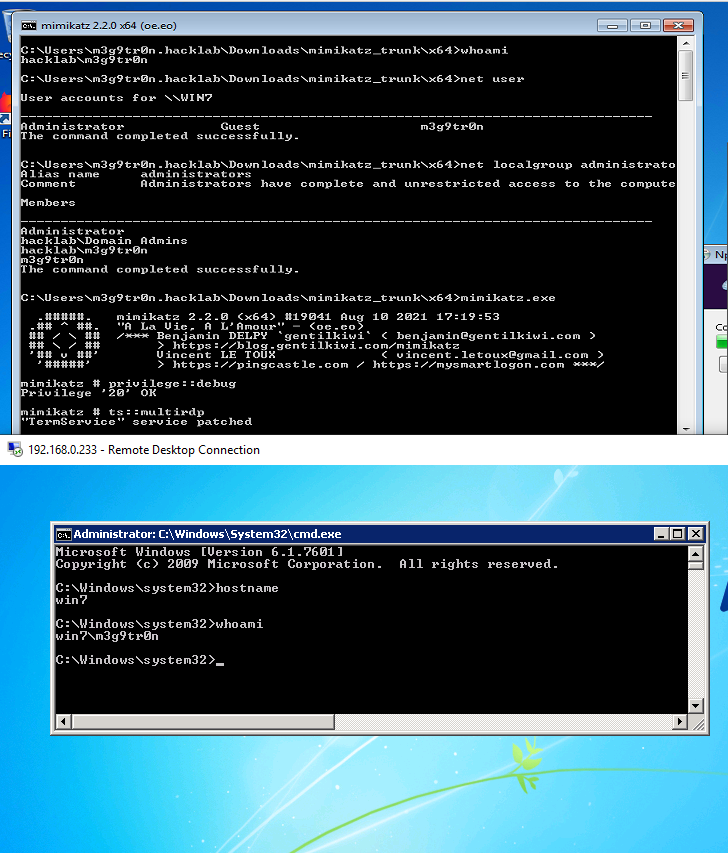

# multirdp

Enables multiple RDP connections on the target server

For the demonstration purposes, our target will be a Windows 7 domain joined workstation. There are two local administrator users:

* `m3g9tr0n` \(Local Administrator\)
* `hacklab.local\m3g9tr0n` \(Domain user part of the local administrators group\)



```text
mimikatz # privilege::debug
Privilege '20' OK

mimikatz # ts::multirdp
"TermService" service patched
```

As a result, it is possible to initiate another RDP connection while the other user is already connected.




According to [Benjamin Delpy](https://twitter.com/gentilkiwi/status/1246510049293451266), the `multirdp` module still works on the following recent versions of Windows:

* Windows Server 2019 - Windows NT 10.0 build 17763 \(arch x64\)
* Windows 10 1909 - Windows NT 10.0 build 18363 \(arch x64\)


